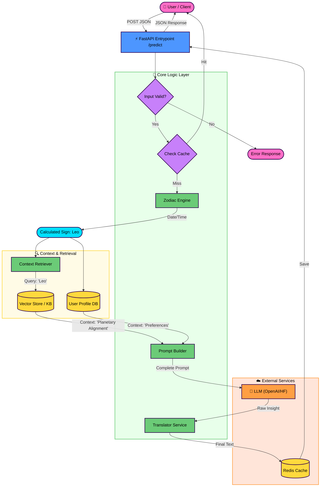

# Astrological Insight Generator
Build a service that takes a user's birth details (name, date, time, and location of birth) and returns a personalized daily astrological insight, using a combination of zodiac logic and LLM-based language generation.

## ⚛️ Horoscope Generation Service Architecture

This document outlines the three primary layers of the **Horoscope Generation Service** architecture, detailing the function and technologies/components within each.

---

### 🌐 The Interface Layer (Blue)

This layer is responsible for handling all incoming **HTTP requests** and ensuring fast, standardized responses.

* **FastAPI:** Serves as the web framework. It handles the initial request processing, **data validation** for inputs, and generating **standardized HTTP error responses**.
* **Cache Strategy:** Implements an immediate check against a high-speed, **in-memory store** (such as **Redis** or a simple **Python dictionary**). This prevents unnecessary and costly calls to the LLM for identical requests (e.g., the same user requesting the horoscope for the same date).

---

### 🧠 The Intelligence Layer (Green)

The core business logic that determines the astrological sign and gathers the necessary context for the prediction.

* **Zodiac Engine:** Contains the **pure Python logic** necessary to accurately determine the astrological sign based on the provided date of birth.
* **Context Retriever (RAG):** Utilizes a **Retrieval-Augmented Generation (RAG)** pattern. It queries a mock **Vector Store** to find astrological rules and lore that are highly relevant to the calculated sign and current planetary positions (e.g., retrieving specific insights about **"Mars in Leo"**).
* **Personalization:** Fetches and incorporates **user history** or explicit user settings to tailor the final prompt (e.g., noting that the **"User prefers career advice"** or has expressed interest in finance).

---

### ✨ The Generation Layer (Grey)

This layer is where the final, personalized horoscope insight is constructed and generated.

* **Prompt Builder:** Aggregates all the gathered components into a single, comprehensive instruction set:
    * The determined **Zodiac Sign**.
    * The **Retrieved Context** (astrological rules).
    * The **User Preferences**.
    This forms the final system instruction for the LLM.
* **LLM & Translation:**
    * The aggregated prompt is sent to the **Large Language Model (LLM)** to generate the horoscope insight.
    * It applies **multilingual support** by translating the generated insight into the requested language if necessary (e.g., if the requested language is **Hindi**).

